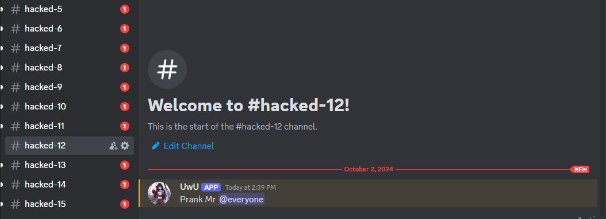
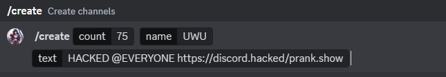
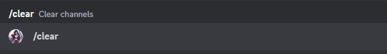

# **Prank Bot [Only For Prank Useage]**

`preview :`

=============================================
## Disclaimer
---------------

This bot is intended for **FUN** and **PRANKING** purposes only. It is not meant to be used for malicious or revengeful purposes. Using this bot to harm or harass others is strictly prohibited and may result in serious consequences. By using this bot, you agree to use it responsibly and in accordance with Discord's terms of service.

## Features
------------

*   **Dynamic Channel Creation**: Create multiple channels with a single command
*   **Mass Text Messaging**: Send a text message to each created channel
*   **Channel Clearing**: Clear all created channels with a single command
*   **Confirmation Prompt**: Confirm before clearing channels to avoid accidents

## Commands
------------

*   `/create [count] [name] [text]`: Create multiple channels with the specified name and send a text message to each channel.

=> `Command Example:`

*   `/clear`: Clear all created channels.

=> `Command Example:`

## Note
--------

*   **The bot is for one-time use only. If used again, the created channels and messages will remain and won't be deleted. We are not responsible for this.**
*   This bot requires the necessary permissions to create and delete channels in the guild.
*   The bot will store the channel IDs in a file named `channels.json` in the same directory as the bot's code.
*   The bot will not work if the `channels.json` file is not present or is corrupted.

## Usage
---------

1.  Use the `/create` command to create multiple channels with the specified name and send a text message to each channel.
2.  Use the `/clear` command to clear all created channels.

## Remember
------------

*   Use this bot responsibly and in accordance with Discord's terms of service.
*   Do not use this bot to harm or harass others.
*   This bot is intended for **FUN** and **PRANKING** purposes only.

## Credits
------------

* If you consider using this Bot, make sure to credit me!
* Example: `**Bot originally by [sebastian_allepay](https://discord.com/users/891002113134563428), modified and updated by [Your Name](https://discord.com/users/userid)**`

## Contributing
------------

* If you want to help improve the Bot code, fix spelling or design Errors or if possible even code errors, you may create PULL REQUESTS.
* Please consider, that [**Sebastian**](https://discord.com/users/891002113134563428) is the main Developer of this Bot, everyone else helped just once or sometimes more often.

# ***USE RESPONSIBLY***

